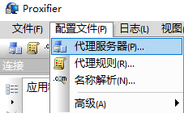
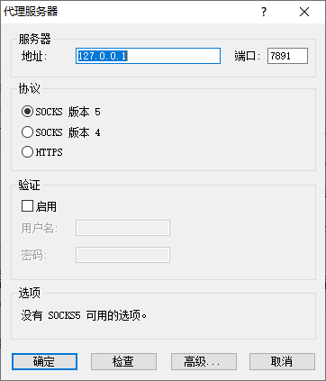
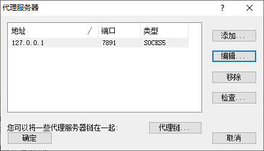
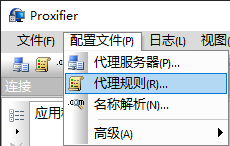
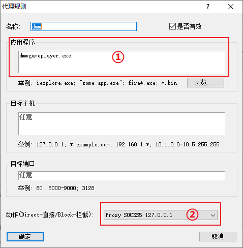
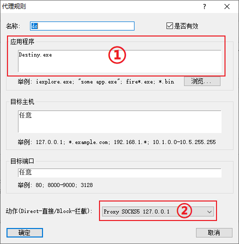
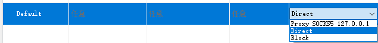
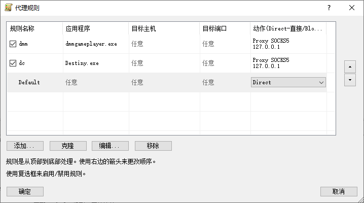

> ★注意：如果使用 岛风Go/ACGP，这两个软件会自动帮你修改 .\rt\lib\net.properties 文件，所以请先将 DMM安装目录下 .\rt\lib\net.properties 删除或者替换成未被修改的版本

#### 0x00 软件环境

- ##### 系统 Windows 10

- ##### [Proxifier](https://www.lanzous.com/i2s70mj "Proxifier")

- ##### 任意科学上网工具

#### 0x01 配置过程

##### 1.  首先打开代理服务器配置

##### 2.  IP 填 127.0.0.1，端口看自己科学上网的本地端口

##### 3.  代理服务器配置完成图

##### 4. 接下来配置代理规则

##### 5.  将 dmm 进程加入代理规则中，①处填写 dmm 的进程（dmmgameplayer.exe） ②处选择服务器，也就是刚才添加的

##### 6. 将 dc 进程加入代理规则中，①处填写 dc 的进程（Destiny.exe） ②处选择服务器，也就是刚才添加的

##### 7. Default 选择 Direct

##### 8. 代理规则配置完成图

##### 9. 这时候启动 dmm 就可以游戏了 

#### 0x02 写在最后
##### 每次游戏前 需要先打开 科学上网软件 和 Proxifier
